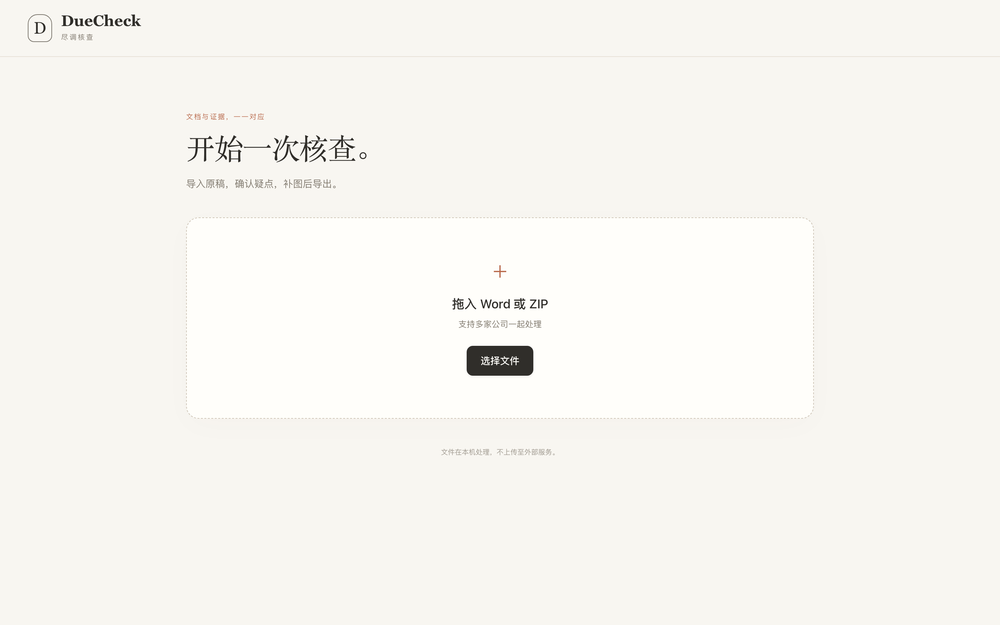
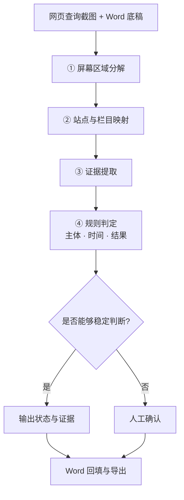

# DueCheck

## 网页核查截图「主体 · 时间 · 结果」自动化质检

> A local evidence-first tool for structured screenshot verification, evidence extraction and human review.

## 界面



> 截图使用虚构/合成数据，仅用于展示程序界面，不包含任何真实业务材料。

该工具用于网页核查截图的**主体、时间和结果**三要素辅助校验。系统先对截图进行界面区域分解，再根据站点和栏目映射定位相关区域，分别提取主体、时间和结果证据，并输出独立状态。无法稳定判断的事项进入人工确认，不由程序补充推断。

需要特别说明：

- “结果”状态仅表示页面是否产生可识别的返回内容，不代表被核查主体不存在异常；
- “时间”状态仅表示对应区域是否可识别，不验证日期的真实性或时效性；
- 定位与识别模块不接收目标公司名、期望结论或历史判定结果。

## 核心能力

| 能力 | 说明 |
|---|---|
| **屏幕区域分解** | 将截图划分为操作系统栏、浏览器外壳和页面视口，并定位查询控件、结果区域和系统时间位置 |
| **站点与栏目映射** | 使用站点级注册表和栏目级几何映射定位待核区域，与具体公司名称解耦 |
| **局部视觉配准** | 使用控件周边静态像素对当前截图进行局部位置校正 |
| **证据绑定的判定** | 主体、时间和结果分别返回状态及其证据来源 |
| **分层归因** | 屏幕分解、页面映射、证据提取和规则判定相互分离，便于定位错误来源 |
| **逐张隔离处理** | 单张截图在独立进程中处理，异常可单独重试，不影响整批任务 |

三项要素使用五种明确状态，而不是单一布尔值：

| 状态 | 含义 |
|---|---|
| `pass` | 当前证据支持该要素 |
| `missing` | 当前证据显示该要素缺失 |
| `mismatch` | 当前证据与目标条件不一致 |
| `unreadable` | 证据区域存在，但识别组件无法可靠读取 |
| `engine_error` | 识别流程未正常执行 |

## 处理流程



## 技术实现

| 层 | 实现 |
|---|---|
| 运行时 | Python 3.10+；首次启动建立本机 `.venv` 并安装依赖 |
| 服务层 | FastAPI + Uvicorn，本地单实例，仅监听本机回环地址 |
| 屏幕分解 | OpenCV + NumPy，仅处理像素几何，不生成业务结论 |
| 页面映射 | `columns.json` + `column_maps.json`，保存站点/栏目注册信息与几何映射 |
| 证据提取 | 原生识别组件运行在独立 worker 进程中，OCR worker 不接收目标公司名或期望结论 |
| 规则判定 | 规则层独立输出五态判定与证据，并包含繁简体归一处理 |
| 视觉识别 | macOS 可使用 Apple Vision；不可用时转人工核对 |
| 文档层 | 源文件保持不变，编辑采用 copy-on-write 方式写入副本 |
| 版式资产 | `map_assets/` 保存 82 组局部特征点和描述子，用于栏目定位，不包含业务截图 |

## 验证状态

本公开版未附带自动化测试套件，因此不提供可复现的测试数量。已完成的结构和完整性检查包括：

- 14 个 Python 模块通过语法检查；
- 12 个库模块可在干净解释器中导入且无启动副作用；
- 82 组 `map_assets/*.npz` 与栏目注册表数量一致；
- `columns.json` 和 `column_maps.json` 均可解析且结构完整。

Apple Vision 识别链路属于 macOS 专属能力，仍需在 macOS 实机环境进行最终验收。

## 快速开始

macOS 可直接双击仓库根目录的 `start_mac.command`。

手工运行：

```bash
cd DueCheck_三要素核查程序
python3 -m venv .venv
.venv/bin/pip install -r requirements.txt
.venv/bin/python start.py
```

## 项目结构

```text
DueCheck_三要素核查程序/
  start.py                 启动器
  app.py                   本地 Web 服务与 API
  engine.py                Word 底稿映射
  spatial.py               屏幕区域分解
  page_map.py              站点与栏目映射
  vision.py                证据提取
  families.py              规则判定
  column_mapper.py         栏目映射与局部配准
  time_presence.py         时间区域像素判断
  ocr_worker.py            原生识别 worker
  scan_worker.py           单张截图 worker
  columns.json             站点/栏目注册表
  column_maps.json         栏目几何映射
  map_assets/              局部版式特征资产
  static/                  Web UI
tools/public_release_check.py   公开版脱敏检查
```

## 数据安全

本仓库为公开展示版本，仅包含通用代码、算法实现和识别资产。实际业务中的任务历史、网页截图原图、输入 Word 文件和导出结果不进入版本库。`map_assets/` 为局部特征点和描述子，不包含原始业务截图。

## 许可

本仓库当前未附开源许可证。公开可见不代表自动授予复制、修改或再分发权限；如需复用，请先联系作者确认授权。
