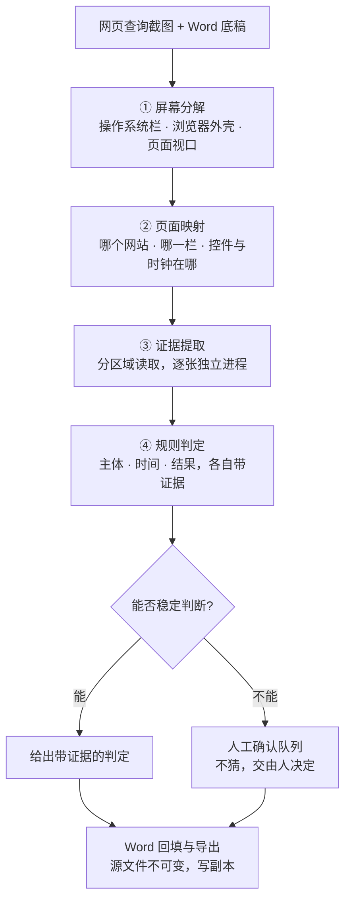

# DueCheck

## 网页核查截图「主体 · 时间 · 结果」自动化质检

> A local evidence-first screenshot checker: it maps each due-diligence screenshot onto the
> site column it is supposed to prove, then returns independent, evidence-carrying verdicts
> for the query subject, the capture-time region and the result feedback — and routes anything
> it cannot decide to human review instead of guessing.

尽调底稿里有一类证据是**网页查询截图**：查的是哪家公司、什么时间查的、系统返回了什么结果。
一份底稿动辄上百张，人工逐张看既慢又容易漏，而且截图可以被换、可以裁剪、可以截图后修改时间。

本工具把这件事拆成一条**分层、可归因**的流水线：把屏幕分解成操作系统栏 / 浏览器外壳 / 页面视口，
把截图映射到它应当证明的那个网站栏目，再分别给出**主体、时间、结果**三项**各自带证据**的判定。
判不了的一律进人工确认队列 —— **不猜**。

关键在于它**不把"看起来对"当成"是对的"**：

- 结果判定的含义严格限定为"这次查询产生了返回内容"，**不等于**"该公司没有问题"；
- 时间判定只回答"时间区域可见"，**不校验**显示的日期、年份是否新鲜或是否被篡改；
- 定位与识别过程**拿不到**目标公司名、期望答案或任何历史结论。


---

## 核心能力

| 能力 | 说明 |
|---|---|
| **屏幕分解** | 把一张截图切成操作系统栏 / 浏览器外壳 / 页面视口三个坐标空间，并定位查询控件、结果容器与系统时钟 |
| **网站栏目映射** | 网站级映射与公司名称解耦；已知栏目复用稳定区域映射，改版或无法可靠判断时转人工确认 |
| **局部视觉配准** | 映射表回答"哪个控件属于哪一栏"，当前截图回答"这个控件现在在哪"；只用控件周边的静态像素做配准 |
| **证据绑定的判定** | 主体 / 时间 / 结果三项各自返回五态判定，**每条判定都带着它所依据的证据** |
| **分层归因** | 流水线按层划分，失败能被归到具体一层，而不是"识别错了" |
| **逐张隔离** | 每张截图独立进程处理，单张卡死可单独重试，不会拖垮整批 |

判定不是"布尔值 + 一个含糊的置信度"，而是五种有明确含义的状态：

| 状态 | 含义 |
|---|---|
| `pass` | 该要素由这张图直接成立 |
| `missing` | 图证明该要素不存在 |
| `mismatch` | 图证明该要素与目标矛盾 |
| `unreadable` | 证据在图上，但识别组件读不出来 |
| `engine_error` | 识别未执行或执行失败 |

## 处理流程



## 技术实现

| 层 | 实现 |
|---|---|
| 运行时 | Python 3.10+；首次启动自动建立本机 `.venv` 并安装依赖 |
| 服务层 | FastAPI + Uvicorn，本地单实例，仅监听本机回环地址 |
| ① 屏幕分解 | OpenCV + NumPy，只测像素几何，**不产文字、不判公司、不判结果** |
| ② 页面映射 | 站点/栏目注册表（`columns.json`）+ 几何映射（`column_maps.json`，`purpose: geometry_only_not_verdicts`） |
| ③ 证据提取 | 原生识别组件隔离在独立 worker 进程；OCR worker **不接收公司名、期望答案或历史结论** |
| ④ 规则判定 | 纯规则层，输出五态判定与证据；含**繁体→简体折叠**，避免政府站点繁体反馈被静默丢弃 |
| 视觉识别 | macOS 上安装 `pyobjc-framework-Vision` 使用本机 Apple Vision；**装不上时降级**：仍可整理 Word，图中公司与结果转人工核对 |
| 文档层 | 源文件不可变，编辑走 copy-on-write OOXML；导出前清理批注与审阅占位内容 |
| 版式资产 | `map_assets/` 82 组局部特征点/描述子，与站点/栏目注册表的 82 个栏目**一一对应** —— 是识别运行资产，**不是**业务截图 |

**为什么没有用"一个模型端到端出结论"**：尽调证据需要能解释。分层之后，"结论是什么"和"为什么是这个结论"
永远绑在一起；某一层出问题也能被精确归因，而不是笼统地"AI 判错了"。

## 验证状态

**如实说明**：本公开版**不附带自动化测试套件**，因此没有可复现的测试基线数字。
已验证的只有以下几条：

- 14 个 Python 模块全部通过语法核验（`ast.parse`），无语法错误；
- 12 个库模块可在干净解释器中导入且**无副作用**（`start.py` 是启动器、没有 `__main__` 守卫，
  导入它会直接起服务，因此明确排除在导入检查之外）；
- 82 组 `map_assets/*.npz` 版式特征资产完整存在，与注册表条目数一致；
- `columns.json`（82 条站点/栏目注册表）与 `column_maps.json`（82 条几何映射）结构完整、可解析。

**尚未验证**：Apple Vision 识别链路属于 macOS 专属能力，必须在 macOS 实机上做最终验收，
本仓库不声称已完成该项。`requirements-dev.txt` 中列有 `pytest` 与 `httpx`，
但公开版未随附测试文件 —— 这是已知缺口，不是"测试已通过"。

## 快速开始

macOS 上双击仓库根目录的 `start_mac.command`。首次运行会自动建立本机虚拟环境并安装依赖：

```
start_mac.command                     # 外层启动器
DueCheck_三要素核查程序/start_mac.command   # 实际启动脚本
```

也可以手工安装运行：

```bash
cd DueCheck_三要素核查程序
python3 -m venv .venv && .venv/bin/pip install -r requirements.txt
.venv/bin/python start.py
```

启动脚本刻意**不使用 `source .venv/bin/activate`** —— venv 的 activate 会记录创建时的绝对路径，
文件夹改名或移动后后台 worker 仍会去找旧路径的解释器；直接调用当前目录下的解释器才能随目录移动。

## 项目结构

```
DueCheck_三要素核查程序/
  start.py                 启动器：保证单实例后打开当前构建
  app.py                   本地 Web 服务与 API
  engine.py                Word 底稿映射；源文件不可变
  spatial.py               ① 屏幕分解与控件几何
  page_map.py              ② 网站/栏目映射、锚点与区域
  vision.py                ③ 证据提取，绑定各层
  families.py              ④ 规则判定（主体/时间/结果）
  column_mapper.py         栏目映射 + 局部视觉配准
  time_presence.py         仅像素级判断时间区域是否可见
  ocr_worker.py            隔离的原生识别 worker
  scan_worker.py           单张截图的隔离 worker
  pixel_*_worker.py        渐进式像素处理与进程调度
  columns.json             站点/栏目注册表
  column_maps.json         栏目几何映射（仅几何，不含判定）
  map_assets/              82 组局部版式特征资产
  static/                  Web UI（原生 JS）
  使用说明.md               使用说明
tools/public_release_check.py   公开版脱敏自检
```

## 数据安全

本仓库为**公开展示版本**，仅包含通用代码、算法实现与回归/识别资产。
实际业务中的任务历史、网页截图原图、输入 Word 底稿与导出结果均不包含在仓库中。

`map_assets/` 保存的是**局部特征点与描述子**，不是业务截图或客户文件；
它们属于程序运行资产，公开版保留以保证识别能力。正式部署版本与本公开仓库分开维护。

## 许可

本仓库当前未附开源许可证。公开可见不等于自动获得复制、修改与再分发许可。
如需复用，请先联系作者确认授权。
