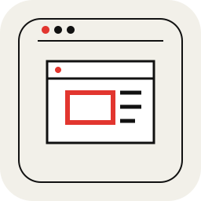
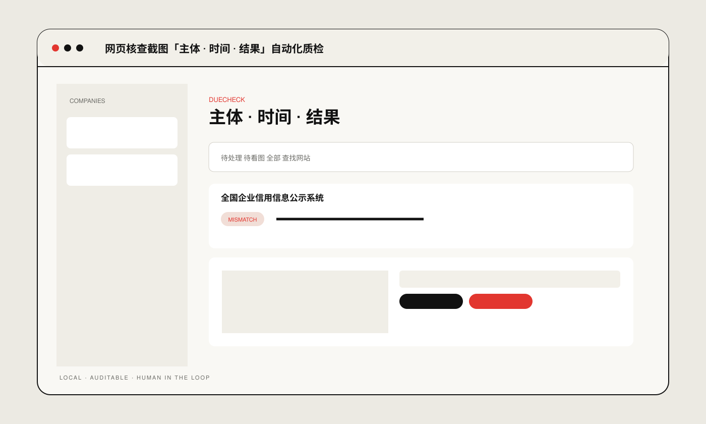

# DueCheck

**网页核查截图「主体 · 时间 · 结果」自动化质检**

A due diligence automation system for structured web verification, evidence extraction and traceable human review.

## Preview

Interface overview is a schematic preview based on the current UI structure, not a screenshot. No real business materials are shown.

**Engineering:** four attributable layers · five-state verdicts · evidence-bound decisions

## Validation

Public release includes integrity checks, not a reproducible regression-test suite. Apple Vision requires final macOS device validation.

## Run locally

- macOS: `./start_mac.command`

Public portfolio edition. No real client documents, production data or internal materials are included.

[Technical notes →](docs/technical-notes.md)
